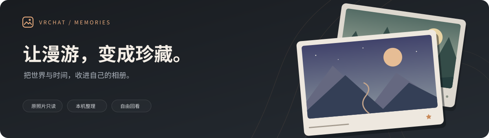

# VRChat 本地相册

**让每一次漫游，都有地方安放。**

把电脑里的 VRChat 照片整理成自己的网页相册。按世界和时间回看，收藏朋友相聚的瞬间，把散落的照片串成一本漫游记录。

**v0.13.0** · **Python 3.10+** · **React + TypeScript + HeroUI** · [MIT License](LICENSE)

[快速开始](#快速开始) · [功能一览](#功能一览) · [使用手册](docs/USAGE.md) · [更新日志](CHANGELOG.md) · [反馈与建议](https://github.com/kimi-tsuki/vrchat-album/issues)

## 照片在本机，回忆由你整理

- **保留原照片**：只读取原图，完全相同的文件合并显示，所有原文件继续保留。
- **接着拍，接着收**：自动检查照片目录和子目录，默认每 20 秒发现新照片。
- **用自己的方式回看**：世界、日期、场次、星标、标签、合集，随时找到想看的那一刻。

日常使用无需注册账号或上传照片。安装完成后，相册页面与照片都从本机加载。

## 功能一览

| 想做什么 | 相册可以帮你 |
| --- | --- |
| 找回某次漫游 | 按世界、月份、日期或场次浏览，搜索文件名、世界 ID、标签与备注 |
| 收藏和整理照片 | 照片星标、世界名、标签、备注，支持多张或整场批量整理 |
| 换一种看图方式 | 六种主题、网格 / 瀑布流 / 横排照片墙，支持全屏、缩放和自动播放 |
| 看看那年今日 | 回看往年同日或同月的照片，也能换个日期，或随机打开一张回忆 |
| 做一本主题相册 | 自动合集与自定义合集；置顶超大海报、错落封面墙、本机自定义封面与可选幻灯片 |
| 从连拍里挑一张 | 相似照片候选分组、原图并排对比，给喜欢的照片加星标 |
| 串起一年的足迹 | 每日世界路线、年度统计、常去世界、精选回忆与回顾 JSON 导出 |
| 编辑后分享照片 | 裁剪、画笔、马赛克、文字、形状、旋转、调色与滤镜，导出 PNG / JPEG 新副本 |
| 撤销一次整理 | 最近 50 次标注操作撤销，整理记录 JSON 导入预览与恢复 |
| 浏览更多照片 | 分批载入索引、按视口渲染卡片与相邻原图预载，兼顾浏览和搜索 |

相似照片分组供你人工比较，所有候选原图继续保留；合集也不会移动照片。详细规则与限制见 [使用手册](docs/USAGE.md)。

## 快速开始

### 1. 下载并解压

[**下载项目 ZIP**](https://github.com/kimi-tsuki/vrchat-album/archive/refs/heads/main.zip)，完整解压到准备长期使用的文件夹。

也可以在仓库右上方选择 **Code → Download ZIP**。不需要安装 Git，也不要把程序放进要扫描的照片目录。

### 2. 双击「打开相册.cmd」

需要已安装 **Python 3.10 或更新版本**，建议使用 Python 3.12+。还没有 Python 时，请先从 [Python 官网](https://www.python.org/downloads/)安装。

启动器会检查环境，首次自动创建项目内的 `.venv` 并安装 Pillow，随后打开相册网页。首次安装依赖需要联网；日常运行 **不需要 Node.js 或 npm**，仓库已提供构建好的界面。

### 3. 选择照片目录

在网页确认建议的 `Pictures / VRChat`，或选择你实际存放照片的文件夹，再点 **开始整理**。

相册会读取 PNG、JPG、JPEG 和 WebP 图片，包含子目录；第一次扫描的进度会显示在页面上。选好的目录会记住，下次双击继续使用。

> 默认地址为 `http://127.0.0.1:18764`。运行期间保持启动窗口打开；停止时可在网页点击「停止后台」，或在窗口按 `Ctrl+C`。关闭网页不会停止后台。

**macOS / Linux 或习惯终端？** 查看 [安装与启动参数](docs/USAGE.md#指定自己的照片文件夹)。

## 开始你的第一本相册

1. **先逛一逛**：按世界或月份缩小范围，点击照片看原图。
2. **给回忆留下线索**：为喜欢的照片加星标，写下世界名、标签和那天的故事。
3. **把线索串起来**：在「合集」「那年今日」和「漫游足迹」里，找到新的回看方式。
4. **留一张新作品**：详情页点「编辑并导出」，编辑后下载新图片。

图片编辑支持最近 60 步撤销 / 重做；编辑步骤仅在当前打开期间保留，离开前记得导出。PNG 保留透明区域，JPEG 使用白底；导出副本不携带原图的 XMP / EXIF 信息，也不会自动加入相册。

## 数据放在哪里

| 内容 | 保存位置 | 如何保管 |
| --- | --- | --- |
| 原照片 | 你选择的照片目录 | 单独备份原图；相册只读 |
| 索引、缩略图、标注、合集及上传封面 | 程序旁的 `data/`，或 `--data` 指定的位置 | 停止后台后备份整个目录 |
| 导出的编辑图片与整理记录 JSON | 浏览器下载目录，或你选择的保存位置 | 由你保管；图片与记录分别导出 |
| 配色、布局等界面偏好 | 当前浏览器的网站数据 | 换浏览器或清除网站数据后需重新设置 |

「导出记录」的 JSON 可以恢复照片标注；完整迁移还需备份 `data/` 和原照片。更新、恢复与旧版迁移步骤见 [备份、恢复和更新](docs/USAGE.md#备份恢复和更新)。

## 常见问题

<strong>需要上传照片，或注册账号吗？</strong>

不需要。相册只监听本机 `127.0.0.1`，照片与整理记录留在电脑上。GitHub 仓库用于获取程序、更新和反馈问题。首次安装依赖需要联网。

<strong>为什么还会出现一个运行窗口？</strong>

目前使用可见的 Python 启动窗口显示启动信息，并维持相册后台运行。浏览器关闭后后台仍在；需要退出时点击网页的「停止后台」、按 `Ctrl+C`，或关闭运行窗口。

<strong>没有照片、世界名缺失，或日期不对怎么办？</strong>

先确认选中了实际照片目录，并等待第一次整理完成。世界名取自照片自带的 XMP 信息，缺失时可以手动补充；日期优先使用 VRChat 文件名，再使用图片日期和文件修改时间。完整排查见 [常见问题](docs/USAGE.md#常见问题)。

<strong>如何更新？需要重新安装前端吗？</strong>

先停止相册并备份 `data/` 与原照片。下载并解压新版本，把原来的 `data/` 复制到新程序旁，再双击启动文件。自定义数据目录的用户继续使用原来的 `--data`。日常用户不需要构建前端；详细步骤见 [使用手册](docs/USAGE.md#备份恢复和更新)。

## 参与项目

欢迎 [提出建议或报告问题](https://github.com/kimi-tsuki/vrchat-album/issues)，也欢迎改进界面、安装体验、文档和测试。觉得好用，可以在仓库右上角点 **Star**。

开发环境、项目结构与检查命令见 [贡献指南](CONTRIBUTING.md)，版本变化见 [更新日志](CHANGELOG.md)。反馈时提供版本、复现步骤和处理过的错误文本；请先移除照片、个人目录和备注等私人内容。

---

由 **kimi-tsuki** 维护 · [MIT License](LICENSE)

本项目是社区工具，与 VRChat 官方无关联。
